Welcome to Kapturo! This guide will walk you through setting up the app and mastering the workflow to turn your daily consumption into powerful, authentic content.

## 1. Setup

Kapturo's magic starts with its native desktop application. This app allows you to seamlessly capture content from anywhere on your computer.

### Downloading the app
To begin, you must install the Kapturo macOS app. The iOS version is in active development and coming soon!

* **Download page:** [https://kapturo.app/portal/downloads](https://kapturo.app/portal/downloads)

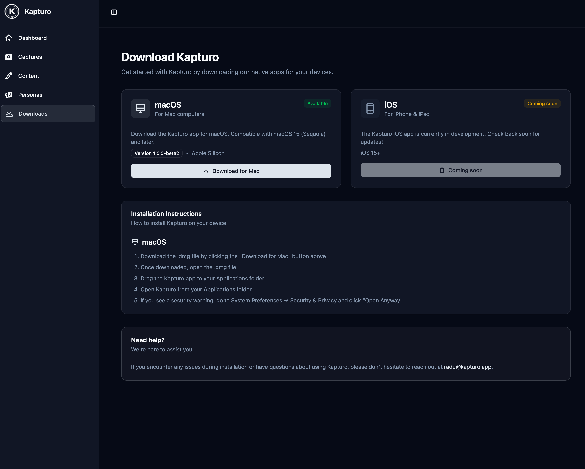

### A note on security
Because the Kapturo app is brand new, it has not yet been verified by Apple. The first time you open it, you will likely see a security message preventing it from running.

To approve the app, simply follow these steps:
1.  Open **System Settings**.
2.  Go to **Privacy & Security**.
3.  Scroll down until you see a message about "Kapturo was blocked from use because it is not from an identified developer."
4.  Click the **Open Anyway** button.

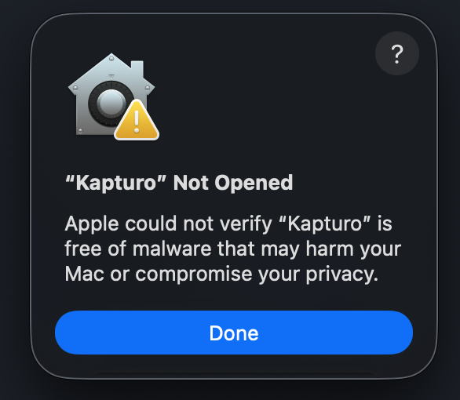
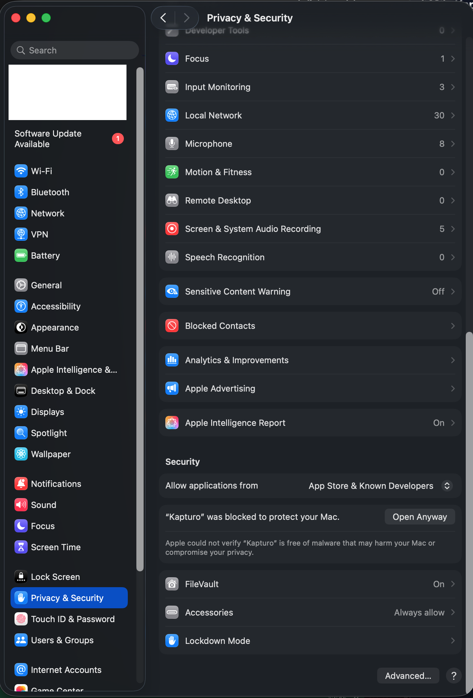

### Granting permissions
Kapturo uses powerful system features to capture content accurately. To enable these, you'll be prompted to grant two permissions:

* **Screen recording:** This allows Kapturo to see the pixels on your screen for Area and Image captures.
* **Accessibility:** This allows Kapturo to intelligently read the UI structure of other applications for the powerful Element capture mode.

> **Your privacy is paramount:** Kapturo only "records" when you actively initiate a capture. Your data is processed locally and does not leave your computer until you hit 'Submit' on the final capture screen.

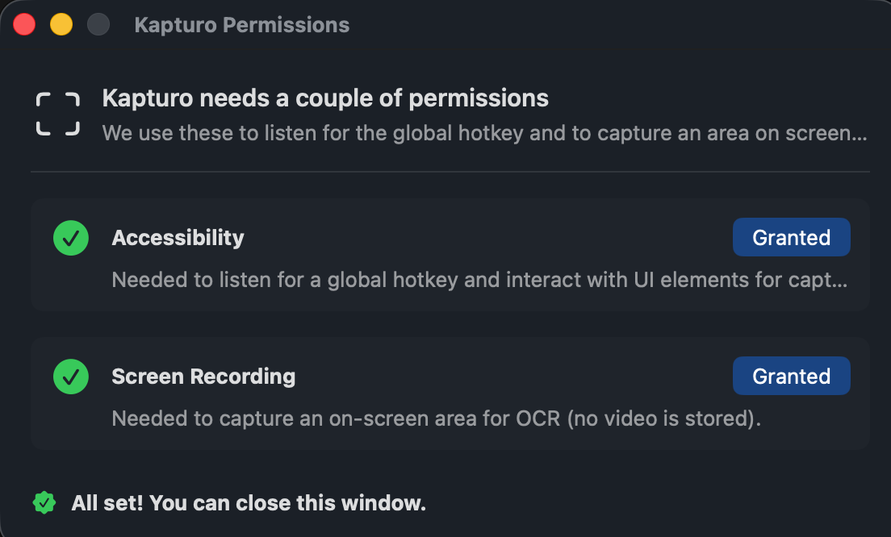

### First run
Once permissions are granted, the app will ask you to log in. After logging in, we recommend reviewing the default keyboard shortcuts in the **Keyboard Shortcuts** menu. You can customize these to fit your workflow perfectly.

Kapturo runs in the menu bar for easy access.

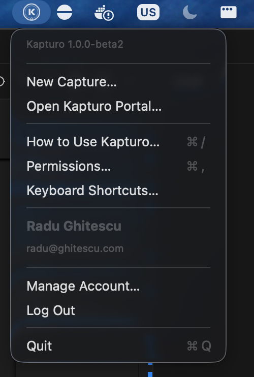
## 2. The art of capturing

Kapturo revolves around **Captures**. A Capture is a single item you save, which can contain one or more **Parts**—the individual building blocks (a quote, a screenshot, etc.) that you'll later remix into content.

### Capture modes
You can activate a capture using your configured keyboard shortcuts.

#### Area mode
Select an area on your screen, and Kapturo will use Optical Character Recognition (OCR) to extract any text within it. Perfect for grabbing paragraphs from articles, tweets, or non-selectable text.

#### Element mode
Using native accessibility features, this mode lets you hover over and select an entire UI element (like a comment thread or a product description). It's ideal for capturing content that isn't fully visible on the screen, as it can grab the content of a scrolling element.

#### Image mode
The most advanced way to capture. Similar to Area Mode, you select a portion of your screen. However, Kapturo uses AI to extract deep insights beyond just text. This is ideal for graphs, charts, or other complex visuals where the context is as important as the data.

### Single vs. multi-capture
* **Single-capture:** The default mode. You capture one Part, add notes, and submit it as a new Capture.
* **Multi-capture mode:** Use this mode to collect multiple Parts into a single Capture. This is great for researching a topic from several sources and grouping all your evidence together.

### Adding your insights (notes)
Before submitting, you'll be asked to add optional notes. **This is a crucial step!** Consider this your personal commentary. What did you find interesting? What's your unique take on this? These notes become the 'magic ingredient' for the AI during content generation.

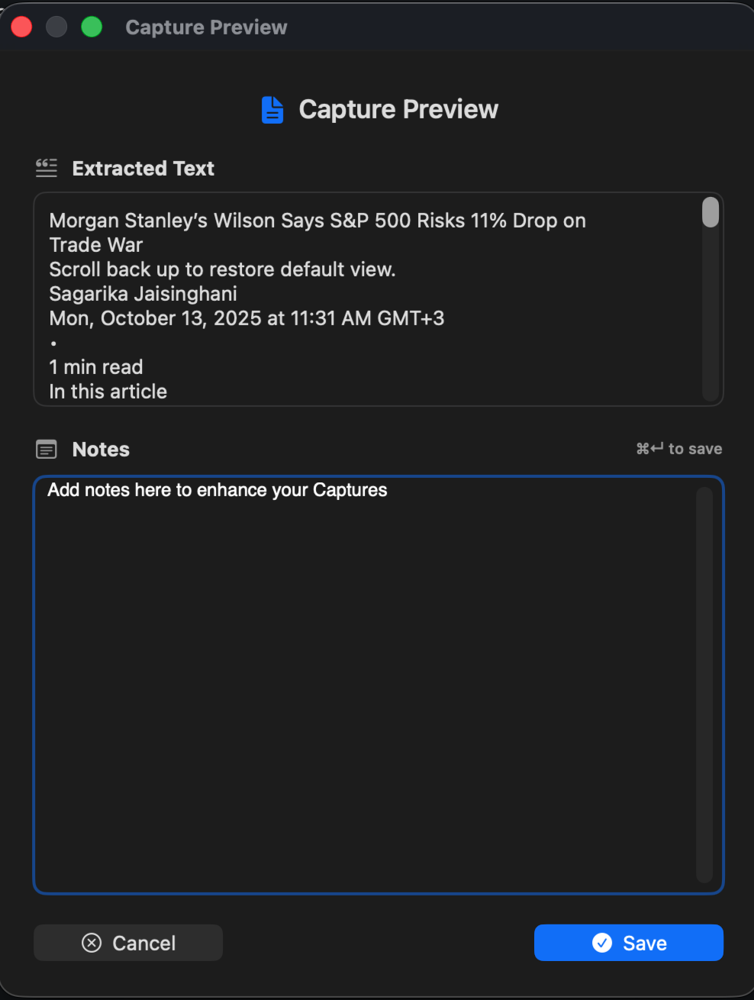

## 3. From capture to creation

Once you've captured your insights, it's time to turn them into content using the Kapturo web portal.

### 1. Review your captures
You can view, edit, and manage all your captures on the Kapturo portal.

* **View captures:** [https://kapturo.app/portal/captures](https://kapturo.app/portal/captures)

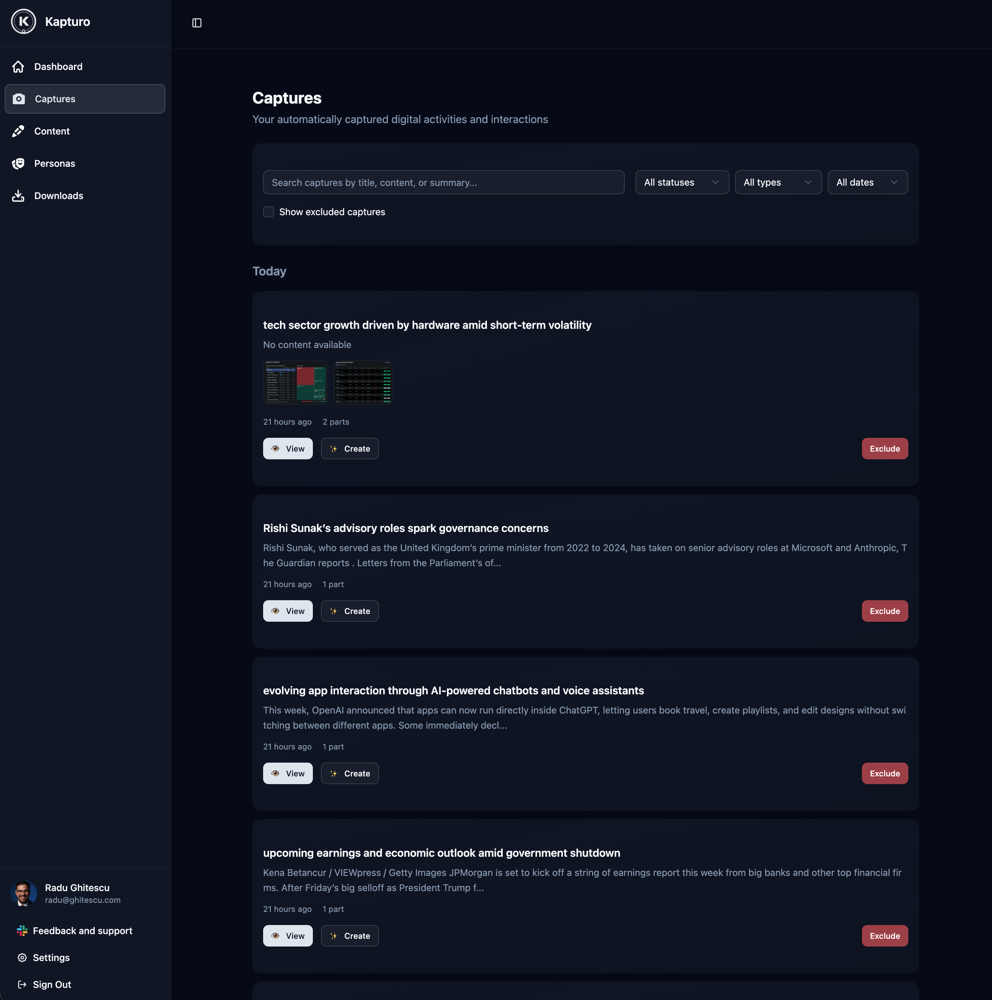

### 2. Set up your personas
A Persona gives your content a consistent voice and personality. Define your tone, audience, and background. You can start from scratch or give the AI a brief description to generate a detailed starting point for you.

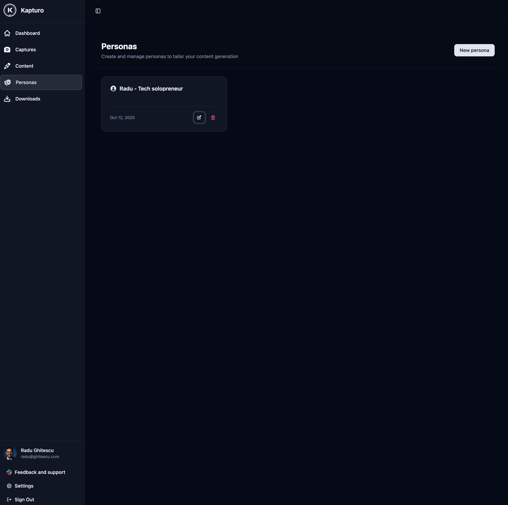
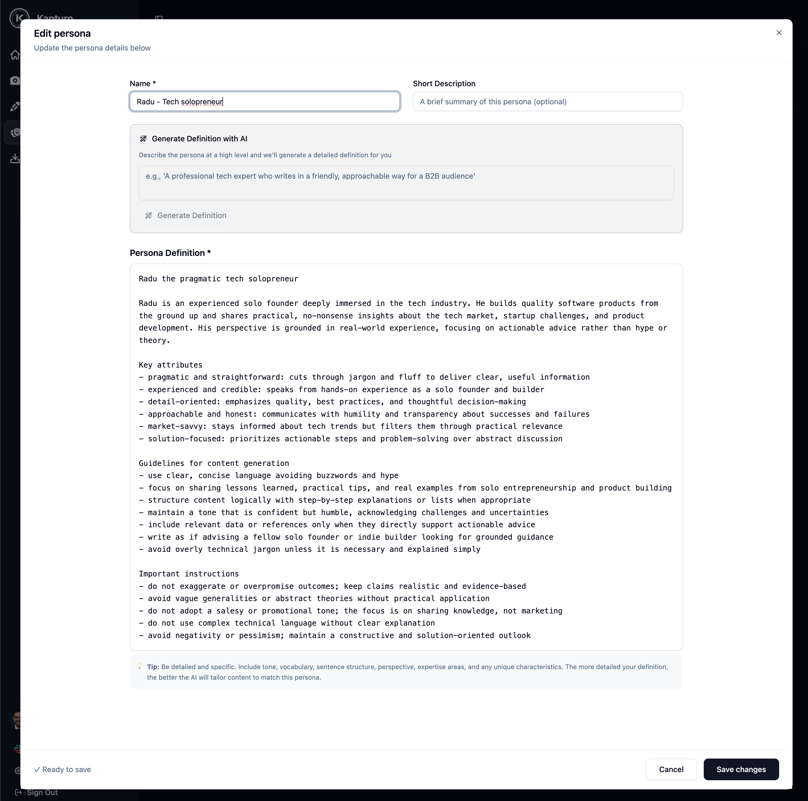

### 3. Generate your post
This is where the magic happens. Navigate to the **Content** page to begin.

* **Generate content:** [https://kapturo.app/portal/content](https://kapturo.app/portal/content)

The process is a collaboration between you and the AI:

1.  **Select:** Choose the Captures you want to use as inspiration and the Persona you want to write with.
2.  **Ideate:** Kapturo will analyze your selections and propose several relevant post ideas or angles.
3.  **Collaborate:** After you select an idea, Kapturo will ask you targeted questions to draw out your personal insights and direct the narrative.
4.  **Draft and Refine:** The AI will present a full draft. From here, you can approve it or provide revision notes ("make it funnier," "add a statistic from my capture") and generate new iterations until you're completely satisfied.

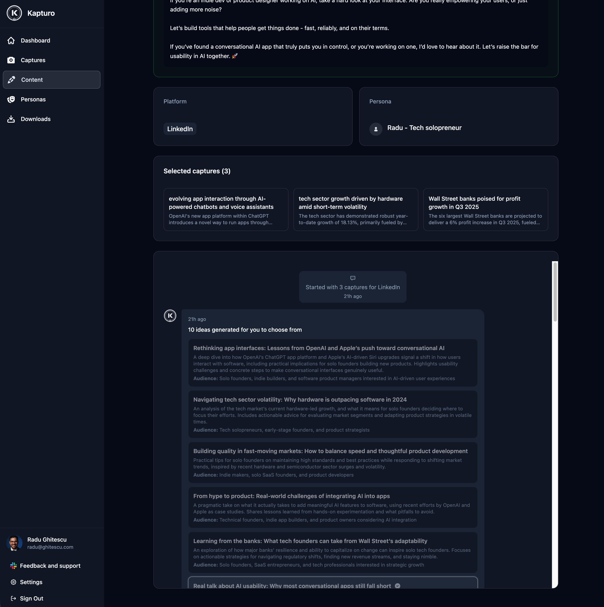
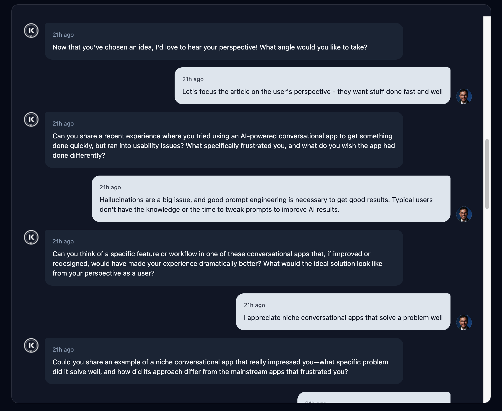

---
